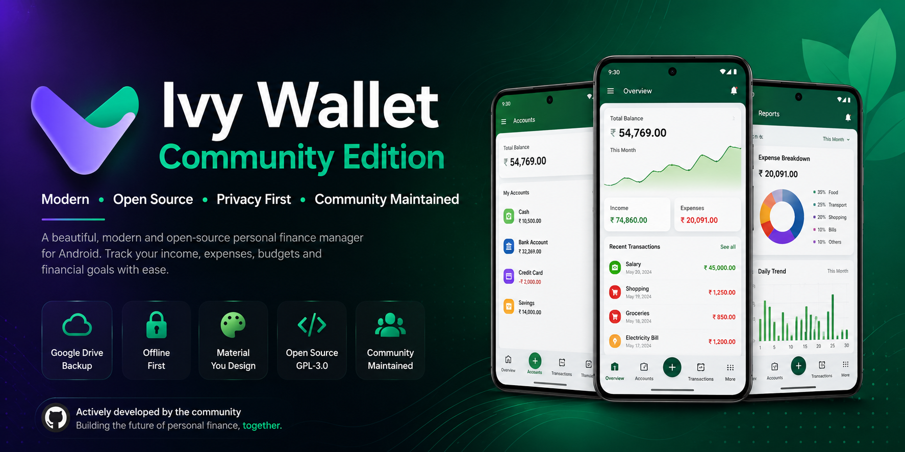

  

<h1 align="center">Ivy Wallet Community Edition</h1>

  <strong>Modern • Open Source • Privacy First • Community Maintained</strong>

A beautiful, privacy-focused personal finance manager for Android built with Kotlin and Jetpack Compose.

⭐ <a href="#features">Features</a> •
📥 <a href="#download">Download</a> •
📸 <a href="#screenshots">Screenshots</a> •
🛣 <a href="#roadmap">Roadmap</a> •
🤝 <a href="#contributing">Contributing</a>

---

> [!IMPORTANT]
>
> ## 🚀 Community Maintained Fork
>
> The original **Ivy Wallet** project is no longer actively maintained.
>
> This repository continues the project under the GPL-3.0 License with ongoing development, dependency updates, bug fixes, and new features while preserving the original vision of a beautiful, privacy-focused finance app.
>
> ### Community Edition Highlights
>
> - ✅ Active development
> - ☁️ Google Drive Backup & Restore
> - 🔒 Privacy First
> - 🚀 Updated Android dependencies
> - ❤️ Community-driven improvements
> - 📦 Regular releases

---

# 📱 Screenshots

> *(These screenshots will be replaced with updated Community Edition screenshots in future releases.)*

| | | | |
|:--:|:--:|:--:|:--:|
|  |  |  |  |

| | | | |
|:--:|:--:|:--:|:--:|
|  |  |  |  |

---

# Features

- 💰 Expense Tracking
- 💳 Income Tracking
- 📊 Financial Reports & Analytics
- 📈 Budget Planning
- 🎯 Financial Goals
- 🏦 Multiple Accounts
- 🏷 Categories & Labels
- 🌙 Material You Design
- 🔒 Offline First
- ☁️ Google Drive Backup & Restore
- 📤 Export & Import
- ⚡ Fast & Lightweight
- 🔓 Fully Open Source

---

# Why Choose Ivy Wallet Community?

Unlike many finance apps, Ivy Wallet Community Edition is built around privacy, simplicity and ownership.

- 🔒 Your financial data stays on your device.
- 🚫 No advertisements.
- 🚫 No subscriptions.
- ☁️ Optional Google Drive backups.
- 🌍 Open-source and transparent.
- ❤️ Maintained by the community.

---

# Download

Download the latest stable release directly from GitHub.

## 📥 **[Download the Latest APK](https://github.com/devxsachin/ivyWalletPublic/releases/latest)**

Every release is built from source and digitally signed.

---

# What's New

## Community Edition v1.0.0

### Added

- Google Drive Backup support
- Updated Firebase configuration
- Updated Google Authentication
- Signed production builds

### Fixed

- Release signing
- Android build issues
- Dependency updates

---

# Roadmap

Planned improvements include:

- Cloud Synchronization
- Automatic Scheduled Backups
- Better Analytics
- Dashboard Widgets
- Tablet UI Improvements
- Wear OS Support
- Desktop Companion
- More Export Formats
- Performance Improvements

---

# Contributing

We welcome contributions from developers, designers, translators and testers.

Whether you'd like to report bugs, improve the UI or implement new features, we'd love your help.

Please read **CONTRIBUTING.md** before opening a Pull Request.

---

# Credits

Ivy Wallet Community Edition is based on the original **Ivy Wallet** project created by **Ivy Apps**.

We sincerely thank the original developers, designers and every community contributor who helped make Ivy Wallet one of the best open-source finance apps for Android.

This project continues under the **GPL-3.0 License**.

---

Made with ❤️ by the Ivy Wallet Community

